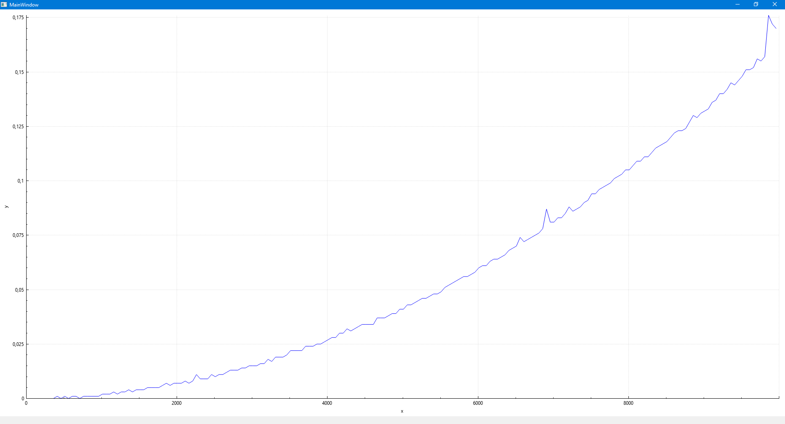

# Проект-конспект: "Алгоритмы построение и анализ"
В данном репозитории предлагается краткий конспект изучаемой книги, решение интересных задач как аналитически так и программно.

В папке Algorithm находиться проект по анализу различных алгоритмов сортировок и прочих алгоритмов рассмотренных в изучаемой книге. Анализ предлагается в виде графика отображающий зависимость скорости работы алгоритмов от колличества элементов.  

Пример оценки времени работы quick_sort.  

